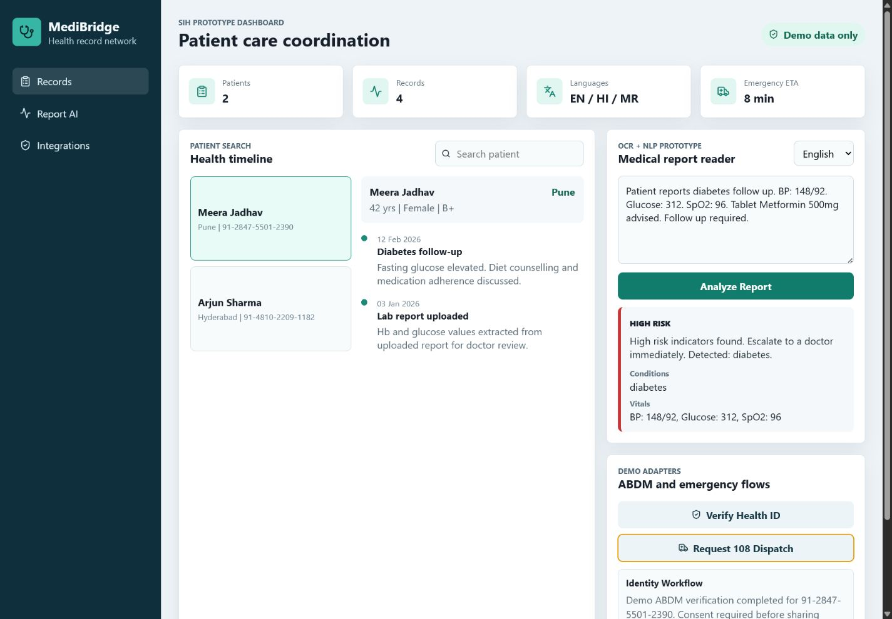

# MediBridge

MediBridge is a health-record management platform built for a Smart India Hackathon style use case. It focuses on secure patient record access, role-based workflows for doctors and health workers, OCR-style medical report analysis, multilingual summaries, and emergency referral workflows.

This repository is a reconstructed, repo-ready version of the project so the implementation can be shared publicly and linked from a resume.

## Preview



## What We Built

- Role-based REST APIs for patients, doctors, health workers, and administrators.
- Patient timeline with visits, diagnosis notes, prescriptions, allergies, and uploaded report summaries.
- JWT authentication with scoped access checks for protected health data.
- OCR/NLP-style report reader prototype that extracts vitals, diagnosis keywords, medications, and risk indicators from medical report text.
- Multilingual summary output for English, Hindi, and Marathi demo workflows.
- Demo integration adapters for Aadhaar-style identity verification, Ayushman Bharat / ABDM-style health identity workflows, and 108 ambulance dispatch flows.
- PostgreSQL schema for users, patients, encounters, medical records, report analyses, and audit logs.
- React dashboard for patient search, record review, report analysis, and emergency workflow demos.

## Important Integration Note

The Ayushman Bharat / ABDM, Aadhaar, and 108 ambulance modules in this public repository are demo adapters. They model the workflow and API contracts used in the prototype, but they do not call live government services or store real identity data. Production use would require official API access, compliance review, consent flows, and secure credential management.

## Tech Stack

- Frontend: React, Vite, CSS
- Backend: Node.js, Express.js
- Auth: JWT, role-based access control
- Database: PostgreSQL schema included, in-memory demo store for local runs
- Infra-ready concepts: audit logs, tenant-safe access patterns, environment-based configuration

## Resume Description

MediBridge - Health Record Management System  
Built role-based REST APIs and a React dashboard for patient health-record management, Aadhaar-style identity verification workflows, medical report analysis, multilingual summaries, and emergency ambulance referral flows. Designed PostgreSQL schema, JWT-based access control, audit logging, and demo integration adapters for Ayushman Bharat / ABDM and 108 Ambulance workflows.

## Project Structure

```text
MediBridge/
  backend/
    db/schema.sql
    src/
      app.js
      server.js
      middleware/
      routes/
      services/
      store/
  frontend/
    src/
      components/
      data/
      services/
```

## Local Setup

### Backend

```bash
cd backend
npm install
cp .env.example .env
npm run dev
```

The backend runs on `http://localhost:4000` by default.

Demo login:

```text
Email: doctor@medibridge.test
Password: demo123
```

### Frontend

```bash
cd frontend
npm install
npm run dev
```

The frontend runs on `http://localhost:5173`.

## API Overview

- `POST /api/auth/login` - demo login and JWT issue
- `GET /api/dashboard/metrics` - dashboard metrics
- `GET /api/patients` - patient search
- `POST /api/patients` - create patient
- `GET /api/patients/:id/records` - patient health timeline
- `POST /api/patients/:id/records` - create encounter record
- `POST /api/reports/analyze` - parse report text and generate multilingual summary
- `GET /api/integrations/abdm/verify/:identityNumber` - demo identity verification workflow
- `POST /api/integrations/ambulance/request` - demo 108 ambulance dispatch workflow

## Security And Privacy Choices

- JWT authentication is required for protected endpoints.
- Role-based authorization separates doctor, health worker, and admin workflows.
- Audit log records sensitive actions in the demo store.
- The public demo uses synthetic patient data only.
- Real PII, Aadhaar numbers, and production medical records should never be committed to GitHub.

## Future Improvements

- Replace demo store with PostgreSQL queries using the included schema.
- Add consent artefacts and patient-controlled record sharing.
- Add real OCR adapter through Tesseract, AWS Textract, Azure Form Recognizer, or another approved OCR provider.
- Add encrypted document storage and field-level encryption for sensitive values.
- Add unit and integration tests for RBAC, report analysis, and integration adapters.
